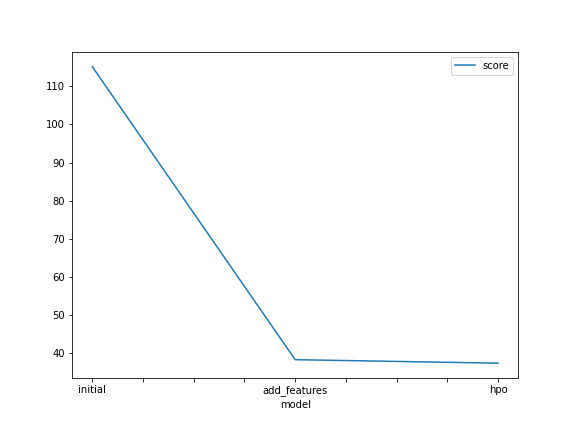
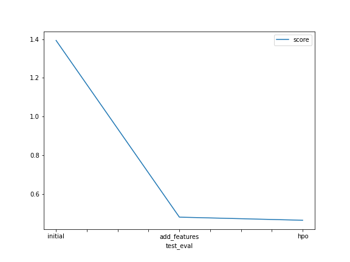

# Report: Predict Bike Sharing Demand with AutoGluon Solution
#### Ensiyeh Raoufi

## Initial Training
### What did you realize when you tried to submit your predictions? What changes were needed to the output of the predictor to submit your results?
 I  described the final predictions series to see if there are any negative values, because Kaggle will reject the submission if we don't set everything to be > 0.

### What was the top ranked model that performed?
 A LightGBMLarge_BAG_L1 model with the kaggle score of 0.45586

## Exploratory data analysis and feature creation
### What did the exploratory analysis find and how did you add additional features?
 I found out that there are some features that don't have a normal or pert distributions and they are in category format. So I changed their type and also I seperated the 'datetime' column to two distinct columns and then ignored the 'datetime' column itself to prevent dependency in features.

### How much better did your model preform after adding additional features and why do you think that is?
 It performed in a significant better way, and I think it's because before this change, models were predicting based on a mixed feature of two independent features('datetime' column) but after separating it to two column and also categorizing some other features our models predicted in a much better way.
## Hyper parameter tuning
### How much better did your model preform after trying different hyper parameters?
 It became very better, because I neglected some time-consuming models like KNN and NN and also fine tuned the hyperparameters using some argument in fit function.

### If you were given more time with this dataset, where do you think you would spend more time?
 I should spend more time in discovering the depencency between features and also the threshold weight of the features based on their importance. For example I think that 'hour' or 'time' feature is very important because in most of the stations we don't have any demand on bake sharing from 10 p.m. to 5 a.m. and our models should predict a count of near zero in these times.

### Create a table with the models you ran, the hyperparameters modified, and the kaggle score.
|model|hpo1|hpo2|hpo3|score|
|--|--|--|--|--|
|initial|problem_type='regression'|learner_kwargs={'ignored_columns':['casual' , 'registered']}|time_limit=600|1.39407|
|add_features|Added two distinct features 'date' and 'time' to train data	|Changing the format of 'season' and 'weather' to category	|learner_kwargs={'ignored_columns':['casual', 'datetime' , 'registered']}|0.47959|
|hpo|hyperparameter_tune_kwargs={'num_trials':5, 'scheduler' : 'local', 'searcher':'auto}|Changing the format of 'workingday' and 'holiday' to category|excluded_model_types = ['KNN', 'NN']|0.45586|

### Create a line plot showing the top model score for the three (or more) training runs during the project.

### Create a line plot showing the top kaggle score for the three (or more) prediction submissions during the project.

## Summary
TODO: I used a TabularPredictor to predict the 'count' column in the test file. I chose the problem type to be a Regression problem (because that's it!) and I used ‘root_mean_squared_error’ for regression. I ignored the 'casual' and 'registered' columns because they are not existed in the test file.  During reading the csv files, I remembered to parse the datetime, so that I could create two new features 'date' and 'time. I changed the types of features l'season' and 'weather' to the Category format, because AutoGluon originally sees them as ints, but in reality they are int representations of a category. Setting the dtype to category will classify these as categories in AutoGluon. I gave a time limit of 10 minutes to the model fitting and then I predicted the test file's 'count' column using my predictor. At the end I  described the final predictions series to see if there are any negative values, because Kaggle will reject the submission if we don't set everything to be > 0.
